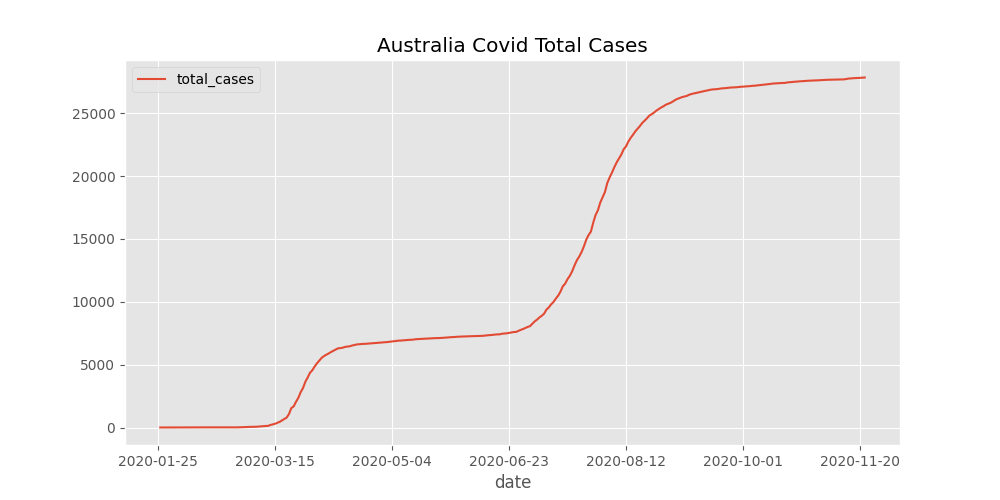

# time_series_plot

It is used data from 'Our World in Data' to plot the number of covid cases in Australia over time. The date ranges from January of 2020 until November of 2020. I made this project to get used to pandas. Below is the plot made.

